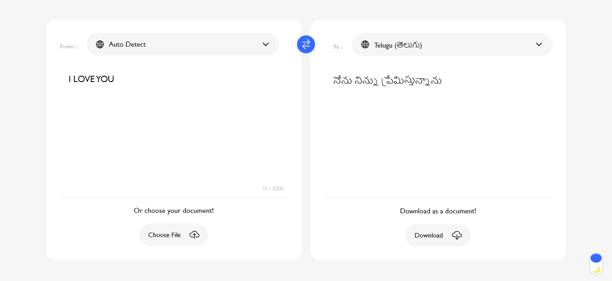

# Language Translator

https://dasarijashwanth.github.io/Language-Translator/

## Overview
The **Language Translator** is a web-based application that allows users to translate text from one language to another. It provides an intuitive user interface with features such as auto-detection of input language, dark mode support, file upload for translation, and the ability to download translated text as a document.

## Features
- **Auto-detect Input Language**: Automatically detects the language of the input text.
- **Language Selection**: Users can select the source and target languages from a dropdown list.
- **Text Translation**: Enter text and get instant translation.
- **File Upload Support**: Allows users to upload documents for translation.
- **Download Translated Text**: Option to download the translated text as a document.
- **Dark Mode**: Toggle between light and dark mode for better usability.
- **Swap Languages**: Swap the input and output languages easily.

## Technologies Used
- **HTML5**: Structure and layout of the web application.
- **CSS3**: Styling and responsive design.
- **JavaScript (ES6+)**: Dynamic functionality and user interactions.
- **Ionicons**: Icon library for UI enhancement.

## Folder Structure
```
Language-Translator/
│── images/              # Contains images for UI elements (e.g., sun, moon icons)
│── script/
│   ├── languages.js     # Manages the list of available languages
│   ├── script.js        # Handles translation logic and UI interactions
│── styles/
│   ├── style.css        # Styles for the application
│── index.html           # Main HTML file
│── README.md            # Project documentation
```

## How to Use
1. **Open the Application**: Run `index.html` in a web browser.
2. **Select Languages**: Choose the source and target languages.
3. **Enter Text**: Type the text to be translated in the input area.
4. **Upload a File (Optional)**: Choose a document for translation.
5. **View Translation**: The translated text appears in the output area.
6. **Download Translation**: Click the "Download" button to save the translation as a file.

## Setup and Installation
1. Clone the repository:
   ```sh
   git clone https://github.com/dasarijashwanth/Language-Translator.git
   ```
2. Navigate to the project folder:
   ```sh
   cd Language-Translator
   ```
3. Open `index.html` in a browser to run the application.

## Future Enhancements
- **Integration with Translation APIs (e.g., Google Translate API)**
- **Speech-to-Text and Text-to-Speech Features**
- **Support for More File Formats (e.g., PDF, DOCX)**
- **Enhanced UI/UX with Animations and Themes**

## License
This project is open-source and available under the [MIT License](LICENSE).

## Contributors
- **Jashwanth** - Developer

For any issues or feature requests, feel free to contribute or open an issue!


